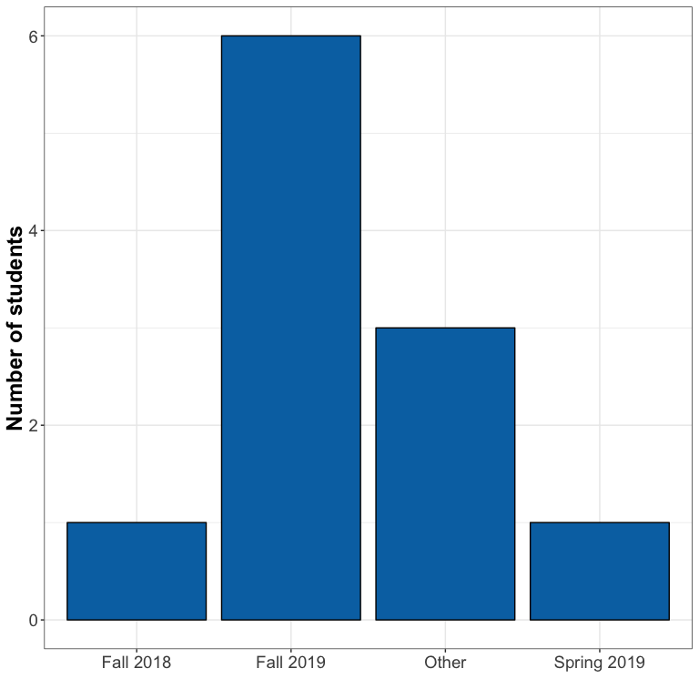

```r
library(data.table)
library(ggplot2)

dt <- fread("../data/educ893_at_proj.csv", sep = ",")
```

## Data exploration

### What is the dataset like? 


```
## Classes 'data.table' and 'data.frame':	1540 obs. of  10 variables:
##  $ User        : chr  "User 1" "User 1" "User 1" "User 1" ...
##  $ Q #         : int  1 1 2 2 2 2 4 4 4 4 ...
##  $ Q Type      : chr  "MC" "MC" "MC" "MC" ...
##  $ Q Title     : chr  "" "" "" "" ...
##  $ Q Text      : chr  "Is this your first time attending a post-secondary institute (college, university, technical institute etc.)?" "Is this your first time attending a post-secondary institute (college, university, technical institute etc.)?" "Which term did you start the CIT program?" "Which term did you start the CIT program?" ...
##  $ Bonus?      : logi  NA NA NA NA NA NA ...
##  $ Difficulty  : logi  NA NA NA NA NA NA ...
##  $ Answer      : chr  "Yes " "No" "Fall 2019" "Jan-19" ...
##  $ Answer Match: chr  "UnChecked" "UnChecked" "UnChecked" "UnChecked" ...
##  $ # Responses : int  1 0 1 0 0 0 0 0 1 0 ...
##  - attr(*, ".internal.selfref")=<externalptr>
```

There are 10 columns and 1540 rows in the dataset. 

### How many users completed the survey?


```
##  [1] "User 1"  "User 2"  "User 3"  "User 4"  "User 5"  "User 6"  "User 7" 
##  [8] "User 8"  "User 9"  "User 10" "User 11"
```

There are 11 users in the dataset. 

### Q1: Is this your first post-secondary degree?


```
##     section answer
##  1:  User 1    Yes
##  2:  User 2    Yes
##  3:  User 3    Yes
##  4:  User 4     No
##  5:  User 5     No
##  6:  User 6     No
##  7:  User 7     No
##  8:  User 8     No
##  9:  User 9     No
## 10: User 10    Yes
## 11: User 11     No
```

<!-- -->


### Q2: Which term did you start the CIT program?


```
##  [1] "Fall 2019" "Fall 2019" "Fall 2018" "Other"     "Other"    
##  [6] "Fall 2019" "Fall 2019" "Jan-19"    "Other"     "Fall 2019"
## [11] "Fall 2019"
```

<!-- -->


### Q3: What do you think is the purpose of the online orientation?


```r
dt[q_text == "What do you think is the purpose of the online orientation?", answer, by = section]
```

```
##    section
## 1:  User 2
## 2:  User 3
## 3:  User 4
## 4:  User 5
## 5:  User 7
## 6:  User 8
## 7: User 10
## 8: User 11
##                                                                                                                                                                                                                                                                              answer
## 1:                                                                                                                                                                                                             To educate students on BCIT related stuff before the program starts.
## 2:                                                                                                      I think the purpose of the online orientation is to provide an orientation online so all students can access the orientation even if they are unable to come to the campus.
## 3:                                                                                                                                                                              To help new students learn about the program and other useful things to kickstart their experience.
## 4:                                                                                                                                                                                                                                                       Learn to use Learning hub.
## 5: All I remember about the online orientation is a pdf we were emailed. Most tangible thing I will say is to email the BYOD info as quickly as possible.   No point receiving an email telling students to bring a 16GB ram laptop few days before school starts. Too short notice
## 6:                                                                                                                                                                                                                                                         What online orientation?
## 7:                                                                                                                                                                                                                 For people like me who didn't/couldn't go to the IRL orientation
## 8:                                                                                                                                                                                                                              To help new students get familiar with BCIT's life.
```

### Q4: Please indicate if you use the online orientation to find information about the following topics. 

<!-- -->


### Q5: Please answer the following questions to help us assess which topics need improvement (knowledge/object assessment). 

#### Where is the TEC Hub located?

<!-- -->


#### When can you start using services insured under the BCITSA Health and Dental Plan?


### Q6: Please answer the following questions to help us assess which topics need improvement (knowledge/object assessment). 

