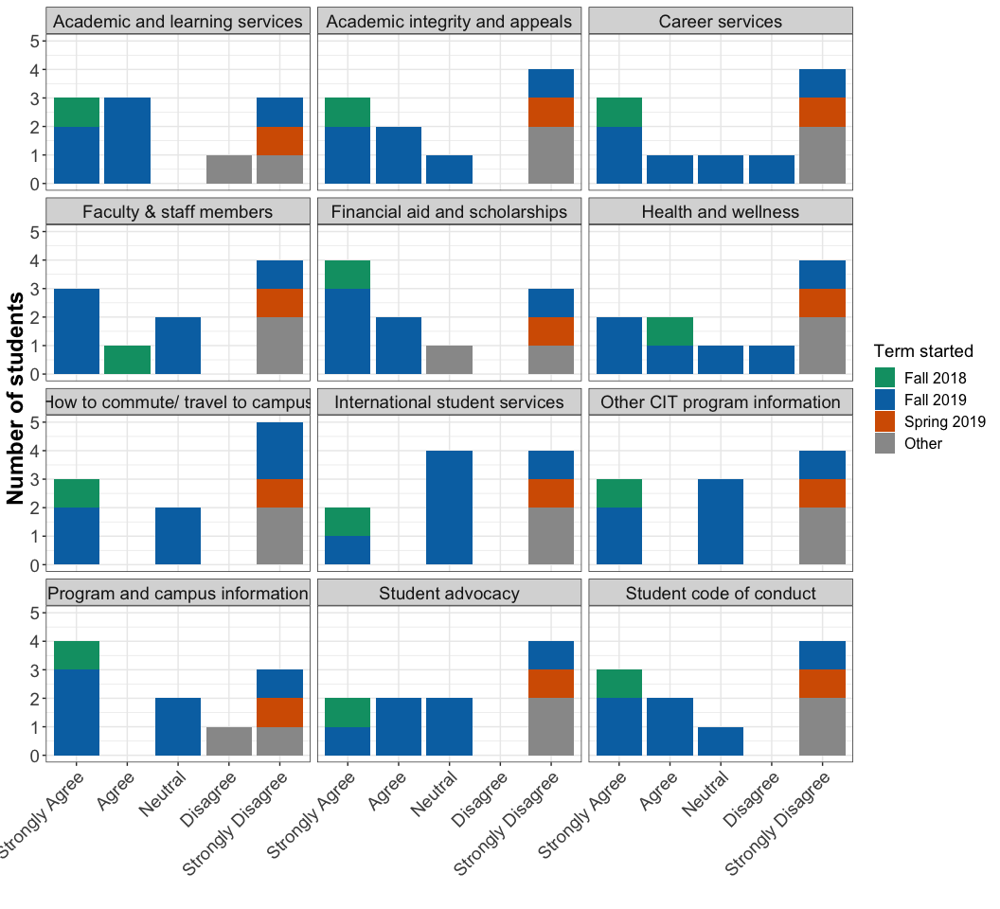
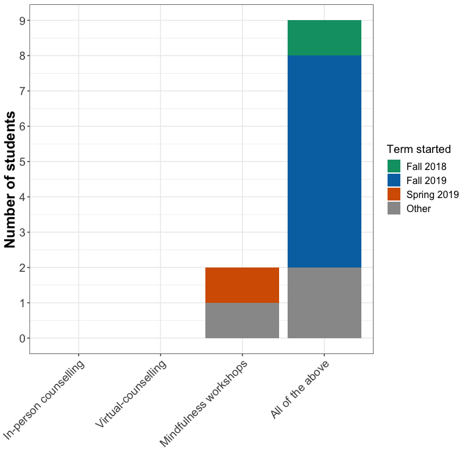
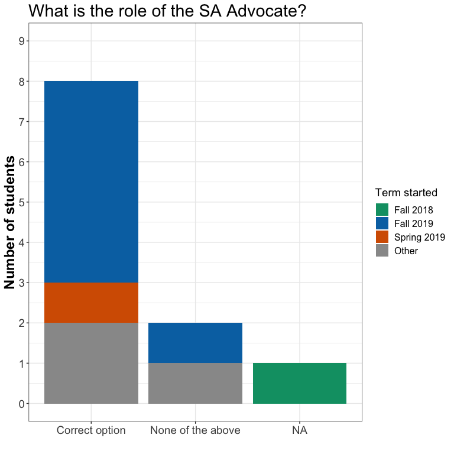
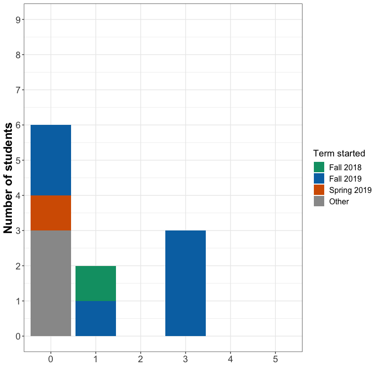
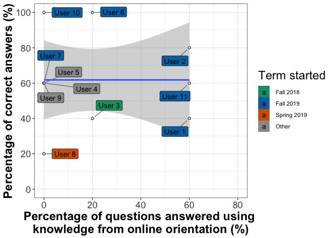
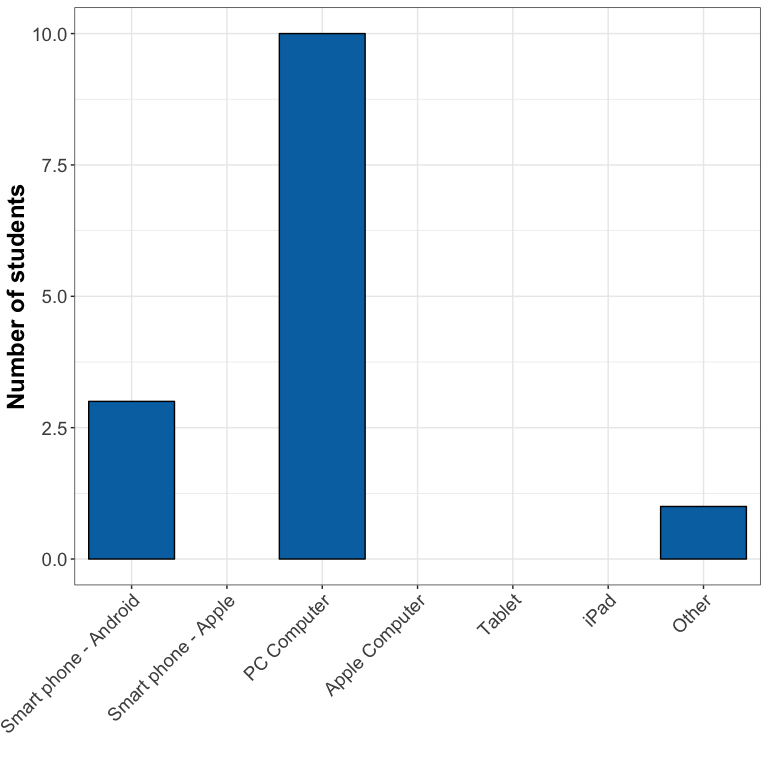
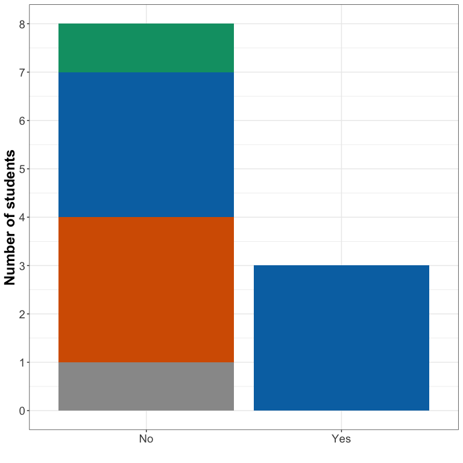

```r
library(data.table)
library(ggplot2)
library(ggrepel)

dt <- fread("../data/educ893_at_proj.csv", sep = ",")
```

## Data exploration


### What is the dataset like? 


```
## Classes 'data.table' and 'data.frame':	1540 obs. of  10 variables:
##  $ User        : chr  "User 1" "User 1" "User 1" "User 1" ...
##  $ Q #         : int  1 1 2 2 2 2 4 4 4 4 ...
##  $ Q Type      : chr  "MC" "MC" "MC" "MC" ...
##  $ Q Title     : chr  "" "" "" "" ...
##  $ Q Text      : chr  "Is this your first time attending a post-secondary institute (college, university, technical institute etc.)?" "Is this your first time attending a post-secondary institute (college, university, technical institute etc.)?" "Which term did you start the CIT program?" "Which term did you start the CIT program?" ...
##  $ Bonus?      : logi  NA NA NA NA NA NA ...
##  $ Difficulty  : logi  NA NA NA NA NA NA ...
##  $ Answer      : chr  "Yes " "No" "Fall 2019" "Jan-19" ...
##  $ Answer Match: chr  "UnChecked" "UnChecked" "UnChecked" "UnChecked" ...
##  $ # Responses : int  1 0 1 0 0 0 0 0 1 0 ...
##  - attr(*, ".internal.selfref")=<externalptr>
```

There are 10 columns and 1540 rows in the dataset. 


### How many users completed the survey?


```
##  [1] "User 1"  "User 2"  "User 3"  "User 4"  "User 5"  "User 6"  "User 7" 
##  [8] "User 8"  "User 9"  "User 10" "User 11"
```

There are 11 users in the dataset. 


## Survey questions

### Q1: Is this your first post-secondary degree?


```
##     section answer
##  1:  User 1    Yes
##  2:  User 2    Yes
##  3:  User 3    Yes
##  4:  User 4     No
##  5:  User 5     No
##  6:  User 6     No
##  7:  User 7     No
##  8:  User 8     No
##  9:  User 9     No
## 10: User 10    Yes
## 11: User 11     No
```

<!-- -->


### Q2: Which term did you start the CIT program?


```
##  [1] "Fall 2019" "Fall 2019" "Fall 2018" "Other"     "Other"    
##  [6] "Fall 2019" "Fall 2019" "Jan-19"    "Other"     "Fall 2019"
## [11] "Fall 2019"
```

<!-- -->


### Q3: What do you think is the purpose of the online orientation?


```r
dt[q_text == "What do you think is the purpose of the online orientation?", answer, by = section]
```

```
##    section
## 1:  User 2
## 2:  User 3
## 3:  User 4
## 4:  User 5
## 5:  User 7
## 6:  User 8
## 7: User 10
## 8: User 11
##                                                                                                                                                                                                                                                                              answer
## 1:                                                                                                                                                                                                             To educate students on BCIT related stuff before the program starts.
## 2:                                                                                                      I think the purpose of the online orientation is to provide an orientation online so all students can access the orientation even if they are unable to come to the campus.
## 3:                                                                                                                                                                              To help new students learn about the program and other useful things to kickstart their experience.
## 4:                                                                                                                                                                                                                                                       Learn to use Learning hub.
## 5: All I remember about the online orientation is a pdf we were emailed. Most tangible thing I will say is to email the BYOD info as quickly as possible.   No point receiving an email telling students to bring a 16GB ram laptop few days before school starts. Too short notice
## 6:                                                                                                                                                                                                                                                         What online orientation?
## 7:                                                                                                                                                                                                                 For people like me who didn't/couldn't go to the IRL orientation
## 8:                                                                                                                                                                                                                              To help new students get familiar with BCIT's life.
```


### Q4: Please indicate if you use the online orientation to find information about the following topics. 

<!-- -->


### Q5: Please answer the following questions to help us assess which topics need improvement (knowledge/object assessment). 


#### Where is the TEC Hub located?

<!-- -->


#### When can you start using services insured under the BCITSA Health and Dental Plan?

<!-- -->


#### What type of mental health services are provided by BCIT?

<!-- -->


#### Learning and accessibility services provided by BCIT include, but are not limited to (i) peer tutoring, (ii) exam and program accommodations (e.g. extended exam times etc.), and (iii) note takers and readers. Out of the 3 examples, how many are you aware about?

<!-- -->


#### What is the role of the SA Advocate?

<!-- -->


#### Based on questions 14 through 18, how many were you able to answer because of the Learning Hub online orientation?

<!-- -->


#### Objective vs. subjective knowledge

<!-- -->


### Q6: How often do you log in to the online orientation?


```
##     section                     answer
##  1:  User 1                      Never
##  2:  User 2   One to two times a month
##  3:  User 3 More than two times a week
##  4:  User 4                      Never
##  5:  User 5                      Never
##  6:  User 6   One to two times a month
##  7:  User 7                      Never
##  8:  User 8                      Never
##  9:  User 9                      Never
## 10: User 10                      Never
## 11: User 11 More than two times a week
```

<!-- -->


### Q7: What device do you use to access the online orientation?


```
##     section                answer
##  1:  User 1           PC Computer
##  2:  User 2           PC Computer
##  3:  User 3 Smart phone - Android
##  4:  User 3           PC Computer
##  5:  User 4 Smart phone - Android
##  6:  User 4           PC Computer
##  7:  User 5           PC Computer
##  8:  User 6 Smart phone - Android
##  9:  User 6           PC Computer
## 10:  User 7           PC Computer
## 11:  User 8           PC Computer
## 12:  User 8                 Other
## 13: User 10           PC Computer
## 14: User 11           PC Computer
```

<!-- -->


### Q8: What browser do you use to access the online orientation?


```
##     section  answer
##  1:  User 1 Firefox
##  2:  User 2  Chrome
##  3:  User 2 Firefox
##  4:  User 3  Chrome
##  5:  User 4  Chrome
##  6:  User 5  Chrome
##  7:  User 6  Chrome
##  8:  User 7 Firefox
##  9:  User 8  Chrome
## 10: User 10  Chrome
## 11: User 11  Chrome
```

<!-- -->


### Q9: Please rank the following characteristics of the Learning Hub online orientation tool on a scale of 1 (poor) to 5 (excellent).

<!-- -->


### Q10: In your view what are the benefits of the online orientation?


```
##    section
## 1:  User 2
## 2:  User 4
## 3:  User 5
## 4:  User 7
## 5:  User 8
## 6: User 10
## 7: User 11
##                                                                                                                                                                                                                                      answer
## 1:                                                                                                                                                                                                       Just the access to certain things.
## 2:                                                                                                                               Allows the student to view at their own time and pace. It is also a resource that is continually availble?
## 3:                                                                                                                                                                                                    No idea, didn't really notice it much
## 4: To be honest, it is really beneficial.  I can see many implications of the online orientation and resources Hubs.   If faculty notifies students about it during first week of term, students will be more aware of the orientation hubs
## 5:                                                                                                                                                               I didn't know it existed and therefore have never used it or looked at it.
## 6:                                                                                                                                                                                                                 ???? I didn't look at it
## 7:                                                                                                                                                                                                Allows student review information online.
```


### Q11: In your view what are the limitations of the online orientation?


```
##    section
## 1:  User 2
## 2:  User 4
## 3:  User 5
## 4:  User 8
## 5: User 10
## 6: User 11
##                                                                                                                     answer
## 1:                                                                      Doesn't always explain everything in great detail.
## 2:                                                                              I didn't know about the online orientation
## 3: I didn't know there was an online orientation. So I suppose a limitation is that you don't get to ask random questions?
## 4:                                                              It was not advertised and we were not notified it existed.
## 5:                                                                                                     I didn't look at it
## 6:                          Students might ignore it, so the information that orientation wants to share might be ignored.
```


### Q12: What changes would you suggest to better accommodate your needs of the online orientation?


```
##    section                                                answer
## 1:  User 2                 A bigger display, and better visuals.
## 2:  User 4 Make it more obvious and separate from course modules
## 3:  User 5           Talk about it in the in-person orientation?
## 4:  User 8            Wouldn't know until I've actually used it.
## 5: User 10                                   Idk I didn't use it
## 6: User 11                                                   N/A
```


### Q13: How did you find out about the online orientation?


```
##    section                                                    answer
## 1:  User 2                                               From email.
## 2:  User 4                                                  I didn't
## 3:  User 5                                               This survey
## 4:  User 8 I found out about it through this SURVEY that it existed.
## 5: User 10                                               This survey
## 6: User 11                                                  verygood
```


### Q14: Were you given information on how to use the Learning Hub online orientation?


```
##     section answer
##  1:  User 1    Yes
##  2:  User 1     No
##  3:  User 2    Yes
##  4:  User 2     No
##  5:  User 3    Yes
##  6:  User 3     No
##  7:  User 4    Yes
##  8:  User 4     No
##  9:  User 5    Yes
## 10:  User 5     No
## 11:  User 6    Yes
## 12:  User 6     No
## 13:  User 7    Yes
## 14:  User 7     No
## 15:  User 8    Yes
## 16:  User 8     No
## 17:  User 9    Yes
## 18:  User 9     No
## 19: User 10    Yes
## 20: User 10     No
## 21: User 11    Yes
## 22: User 11     No
##     section answer
```

<!-- -->


